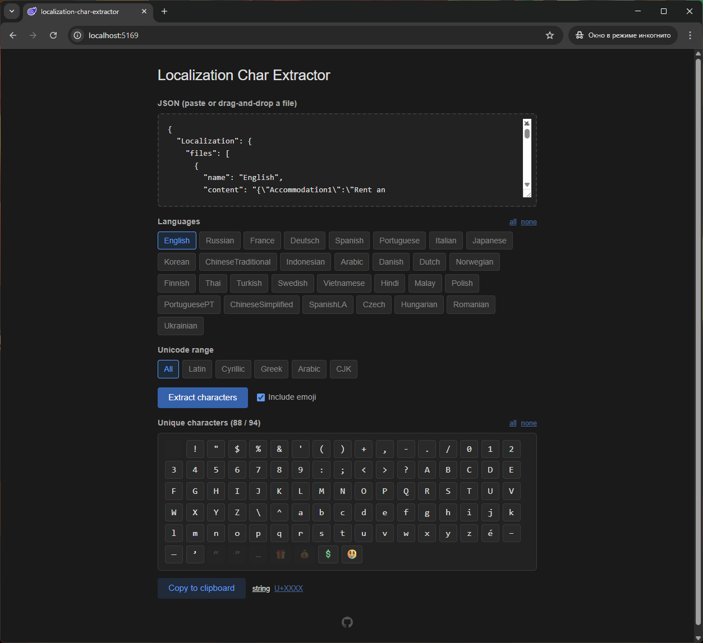

# Localization Char Extractor

[](LICENSE.md)

[](https://llarean.github.io/localization-char-extractor/)

> [!WARNING]
> **Work in progress.** Use at your own risk.

> [!NOTE]
> This is a prototype built with the assistance of AI

Browser-based utility for extracting unique characters from localization JSON files. Useful for generating character sets required by custom fonts in game and app localization workflows.

## Preview



## Live Demo

**[https://llarean.github.io/localization-char-extractor/](https://llarean.github.io/localization-char-extractor/)**

## Quick Start

1. Paste or drag-and-drop your localization JSON into the input field
2. Select one or more languages from the auto-detected list
3. Optionally filter by Unicode range and toggle emoji inclusion
4. Click **Extract characters** (or press `Ctrl+Enter`)
5. Fine-tune the result by clicking individual characters to exclude them
6. Choose an output format and copy to clipboard

## Features

- **Multi-language selection** — extract from multiple languages at once and merge into a single deduplicated character set
- **Unicode range presets** — filter output to All / Latin / Cyrillic / Greek / Arabic / CJK
- **Emoji filter** — include or exclude emoji characters from the result
- **Interactive character grid** — click any character to exclude it from the copied result; use **all / none** to select in bulk
- **Output formats** — copy as a plain string (for TextMesh Pro *Custom Characters*) or as space-separated `U+XXXX` codes (for BMFont, Hiero, and similar tools)
- **Hover tooltips** — shows the Unicode code point (`U+XXXX`) for each character
- **Drag-and-drop** — drop a `.json` file directly onto the input area
- **Persistent input** — JSON is automatically saved to `localStorage` and restored on page reload
- **Keyboard shortcut** — `Ctrl+Enter` triggers extraction from anywhere on the page

## Requirements

- A modern browser (Chrome, Firefox, Edge)
- No installation needed — runs entirely in the browser

## Expected JSON Structure

```json
{
  "Localization": {
    "files": [
      {
        "name": "English",
        "content": "{\"KEY_HELLO\": \"Hello\", \"KEY_WORLD\": \"World\"}"
      },
      {
        "name": "Japanese",
        "content": "{\"KEY_HELLO\": \"こんにちは\", \"KEY_WORLD\": \"世界\"}"
      }
    ]
  }
}
```

## Project Status

Experimental. Core functionality works but has not been tested across all localization file configurations.

---

<div align="center">

**Made with ❤️ for the localization community**

⭐ If this project helped you, please consider giving it a star!

</div>
